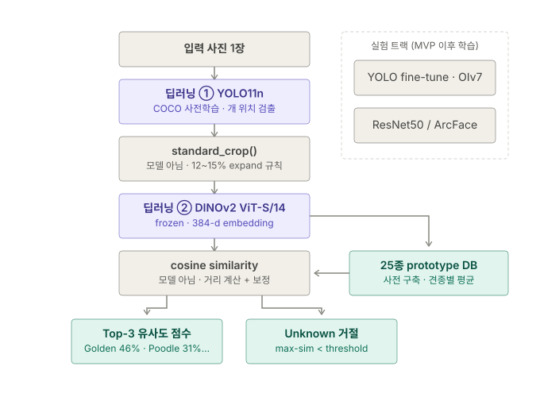
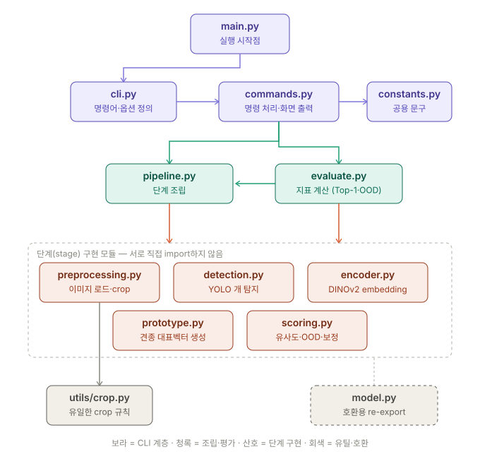
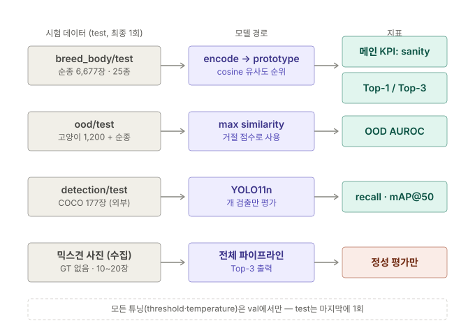

[README.md](https://github.com/user-attachments/files/31059340/README.md)
# FindDogBreed

object detection으로 사진에서 '강아지 이미지'를 잘라 모델에 학습시킨 후, 견종 별 특징을 추출한 뒤 내 강아지가
**어떤 견종의 외형적 특징과 얼마나 유사한지 추정하는 프로젝트**입니다.

> **주의:** 최종 출력값은 실제 DNA 혈통 비율이 아니라, 이미지에서 관찰된 외형적 특징을 기준으로 계산한 **Phenotype Similarity Score**입니다.
> `docs/댕댕이로 보는 단계별 예시.txt` 꼭 읽어주세요

---

## 0. Pain Point & 문제정의

**Pain Point** — 사람도, 보호소 전문가도 믹스견의 품종 구성을 외형으로 잘 맞히지 못한다
(DNA 대비 최우세 품종 정답률 56.7%, 두 품종 모두 정답 10.4% — Gunter et al. 2018).
그런데 기존 AI 품종 분류기는 한 품종만 단정(single-label)해서 오히려 더 나쁜 답을 준다.

**문제정의** — Single-label 분류 문제를 **다중 품종 유사도 추정 문제로 재정의**하고,
출력이 DNA가 아니라 Phenotype Similarity임을 시스템 설계 자체(출력 명칭, 면책 문구, Unknown 처리)에 박아 넣는다.

---

## 모델 아키텍처 한눈에 보기



- **딥러닝 모델은 보라색 2개** — ① YOLO11n(개 위치), ② DINOv2(외형→384-d embedding). Day-1은 둘 다 사전학습 그대로, 학습 0회
- 회색은 모델이 아닌 규칙/계산 — `standard_crop()` 전처리 규칙, cosine similarity 거리 계산
- **prototype DB**는 별도 모델이 아니라 DINOv2를 재사용해 25종 순종 embedding을 평균 낸 사전 준비물
- 점선 상자 = MVP 이후 실험 트랙 (YOLO fine-tune, ResNet50/ArcFace) — 구조는 그대로, 보라 박스 내용물만 교체

## 코드 아키텍처 한눈에 보기



- 통제 방향은 위→아래: main은 시작 버튼, cli가 명령을 정의, commands가 아래층에 일을 시킴
- 산호색 단계 모듈 5개는 서로를 모름 — 조합은 pipeline이 담당 (한 단계 교체해도 다른 단계 안 깨짐)
- 모듈별 책임과 원칙은 [ARCHITECTURE.md](ARCHITECTURE.md) 참조

---

## 1. Stage 1 — Dog Detection

일반 사진에서 강아지가 어디에 있는지 찾는 Object Detection 단계입니다.

```text
[Day-1 경로 — 학습 없음]
YOLO11n (COCO 사전학습)
      ↓
class filter = dog
      ↓
Dog Detector  ✅ 설치 직후 동작

[개선 실험 트랙 — 이후]
Open Images V7 (21,586장)
      ↓
YOLO fine-tune
      ↓
robustness 개선 (가림·다중 개체·복잡 배경)
```

### 이 단계의 역할

YOLO는 견종을 구분하지 않습니다. 배우는 것은 오직:

> **"사진 속 어디에 강아지가 있는가?"**

### Crop 규칙 (train = inference 완전 동일 — 제1원칙)

```text
dog bbox
   ↓ 각 변 12~15% expand
   ↓ 긴 변 기준 square (창 확장, 중심 고정)
   ↓ 이미지 경계 clamp → 잘린 만큼 회색 padding (내용물 중앙 배치)
   ↓ resize
Breed Encoder 입력
※ 순서는 utils/crop.py의 standard_crop() 구현이 기준 (square가 clamp보다 먼저)
```

⚠️ 이 규칙은 **Prototype 구축 시와 Inference 시에 반드시 동일하게** 적용합니다.
crop 방식이 어긋나는 것이 실전 정확도를 가장 많이 깎는 사고 지점입니다.

---

## 2. Stage 2 — Breed Encoder

강아지 crop을 **Feature Vector(Embedding)** 로 변환하는 단계입니다.

```text
[Day-1 경로 — 학습 없음]
DINOv2 ViT-S/14 (frozen)
      ↓
crop → 384-d embedding → L2 정규화
✅ frozen feature + prototype만으로 fine-grained 분류가 강력하다는 근거 있음 (SimpleShot 계열)

[개선 실험 트랙 — 이후]
Tsinghua Dogs + Stanford Dogs (25종)
      ↓
ArcFace fine-tune (margin 0.3~0.5, P×K balanced sampler)
      ↓
breed 전용 embedding space
```

### DINOv2 선정 근거

1. **설계 적합성** — 본 과제는 단일 품종 분류가 아니라 외형 특징을 embedding 공간에
   표현하고 순종 prototype과의 유사도를 계산하는 문제. 특정 label에 최적화된
   classifier보다 **범용 visual representation을 제공하는 self-supervised 인코더**가 적합
2. **학습 0회로 fine-grained 분류 가능** — frozen feature + prototype(class 평균)만으로
   fine-grained 분류가 강력하다는 선행 근거 (SimpleShot 계열)
3. **Label 누수 없음** — supervised ImageNet 모델과 달리 품종 label을 학습한 적이 없음.
   단, 이미지 중복 가능성은 모델과 무관하게 존재하므로 **평가는 Tsinghua 고유분(비중복)
   기준으로 통제** (7. 평가지표 참조)

> **Q. DINOv2도 사전학습에서 평가 이미지를 본 것 아닌가?**
> A. 맞다 — DINOv2의 LVD-142M에는 ImageNet-22k가 포함되므로(arxiv.org/abs/2304.07193)
> 이미지 수준 중복 가능성은 ResNet과 동일하게 존재한다. 다만 self-supervised라
> **품종 label을 본 적은 없고**(label 누수 없음), 이미지 누수는 모델과 무관하게 남기
> 때문에 **평가 데이터 쪽에서 통제**했다: 모든 튜닝은 val에서만, test는 최종 1회,
> 공식 수치는 pHash 중복 제거를 거친 Tsinghua 고유분 기준.
> ⚠️ "DINOv2는 ImageNet을 안 봐서 leakage-free"라는 주장은 사실 오류이므로 금지.

Encoder가 포착하는 견종별 외형 특징:
얼굴 형태 · 귀 모양 · 주둥이 비율 · 털 색상 · 털 texture · 체형 · 다리 비율 · 꼬리 형태 · 전체 silhouette

```text
Dog Crop
    ↓
Breed Encoder
    ↓
[0.213, -0.481, 0.092, ..., 0.331]   ← L2 normalized
```

---

## 3. Stage 3 — Breed Prototype Generation

각 순종 견종의 대표 Feature Vector를 생성합니다.

```text
Golden #1 → Embedding
Golden #2 → Embedding
...
Golden #N → Embedding
      ↓
정규화 → 평균 → 재정규화 (+ 전체 평균 centering, CL2N)
      ↓
Golden Retriever Prototype
```

- 클래스당 이미지 **20~50장이면 수렴** — 데이터가 많아도 50장 캡 가능
- centroid와 cosine 하위 5~10%는 outlier로 제거 후 재계산
- Prototype 계산 이미지에는 **augmentation 미적용** (crop 규칙만 동일 적용)

같은 방식으로 25개 견종 Prototype을 만듭니다.

---

## 4. Inference — Mixed-Breed Image

```text
사용자 믹스견 사진
      ↓
YOLO Dog Detector
      ↓
강아지 Crop (12~15% expand 규칙)
      ↓
Breed Encoder
      ↓
Feature Vector (L2 norm)
      ↓
25개 순종 Prototype과 Cosine Similarity
      ↓
┌─────────────────────────────────────┐
│  max similarity < threshold ?       │
│                                     │
│  YES → ⚠️ Unknown 출력:             │
│  "현재 지원하는 품종만으로            │
│   설명하기 어렵습니다"                │
│                                     │
│  NO  → Top-K Selection              │
│        ↓                            │
│  Calibration (temperature softmax)  │
│        ↓                            │
│  Golden Retriever 46%               │
│  Poodle            31%              │
│  Cocker Spaniel    14%              │
│  Other              9%              │
└─────────────────────────────────────┘
```

**Unknown/OOD 분기는 필수입니다.** 이 분기가 없으면 고양이 사진을 넣어도
"Golden 46%"가 출력됩니다. threshold는 validation의 순종 vs 고양이(Oxford)
max-similarity 분포에서 1개 값으로 결정합니다.

---

## 5. Prototype Similarity → Score

```text
Golden Retriever Prototype   → similarity 0.91
Poodle Prototype             → similarity 0.82
Cocker Spaniel Prototype     → similarity 0.61
Husky Prototype              → similarity 0.18
...
```

이 값은 그대로 퍼센트로 사용하지 않습니다.

```text
Cosine Similarity → Calibration → Normalization → Phenotype Similarity Score
```

---

## 6. Important Interpretation

결과를 이렇게 해석하면 **안 됩니다**: `Golden Retriever DNA 46%`

정확한 의미:

> **현재 지원하는 순종 견종들의 시각적 Prototype과 비교했을 때 나타나는 상대적인 외형 유사도**

최종 출력의 공식 명칭: **Phenotype-based Breed Similarity** (= Visual Breed Similarity Score)

---

## 7. 평가지표



- 기능별로 따로 평가: 견종 판별력(breed test) / 거절 능력(OOD) / 검출력(COCO 외부) — 한 숫자로 뭉치지 않음
- 믹스견 트랙만 산호색 = **정량 지표 없음** (혼합 비율 GT가 세상에 없으므로 정성 평가만)
- 맨 아래 점선이 제1규칙: 모든 튜닝은 val에서, **test는 최종 1회** (사람 손에 의한 누수 방지)

| 우선순위 | 지표 | 방법 | 비고 |
|---|---|---|---|
| **메인 KPI** | Purebred sanity check | 순종 test 입력 시 해당 품종이 Top-1인 비율 | GT가 확실한 유일한 composition 검증 |
| 표준 | Top-1 / Top-3 Accuracy | 25종 test set | 공식 수치는 Tsinghua 외부 test 기준 (Stanford는 ImageNet 누수로 참고치) |
| 필수 | OOD 거절 | Oxford 고양이 vs 순종의 max-sim AUROC / rejection rate | Unknown 분기 검증 |
| 시간 되면 | Detection recall | COCO 177장 + OIv7 val 1,586장 | pretrained YOLO 성능 확인 |

> ❌ **금지**: "믹스견 품종 비율 정확도 XX%" — mixed GT가 없으므로 성립 불가.
> 믹스견은 정성 평가(Top-K 합리성) + 인간 베이스라인(MuttMix 데이터) 논의로 다룬다.

---

## 8. Full Pipeline

```text
[DAY-1 SETUP — 학습 없음]

YOLO11n (COCO pretrained, dog filter)     DINOv2 (frozen)
                                                ↓
                              Tsinghua + Stanford 25종 crop
                                                ↓
                                    클래스당 ≤50장 embedding
                                                ↓
                                       25 Breed Prototypes

[이후 실험 트랙]
OIv7 → YOLO fine-tune  /  ArcFace encoder 학습  /  head crop ablation

────────────────────────────────────

[INFERENCE]

User Dog Image
      ↓
YOLO Dog Detector
      ↓
Dog Crop (12~15% expand)
      ↓
Breed Encoder → Feature Vector
      ↓
25 Prototypes와 Cosine Similarity
      ↓
max-sim < threshold → "Unknown" 출력
      ↓ (통과 시)
Top-K + Calibration
      ↓
Golden Retriever 46% / Poodle 31% / Cocker 14% / Other 9%
```

---

## Current Scope

```text
Dog Detection (pretrained)
      ↓
Dog Crop (표준 규칙)
      ↓
Breed Encoder (frozen)
      ↓
Breed Prototype (25종)
      ↓
Top-K Phenotype Similarity + Unknown 거절
```

- DNA ancestry prediction, supervised mixed-breed composition regression은 MVP 범위 밖
- YOLO fine-tune, ArcFace 학습, head crop ablation, calibration(ECE) 고도화는 **실험 트랙**으로 분리
